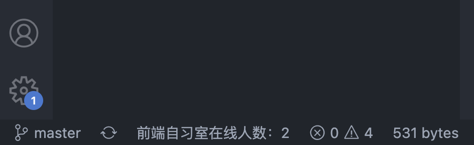

# 前端自习室
> 专注以任务的方式进行学习，并且可以统计时长，方便以后总结时间都去哪了～

## 如何使用

## 新建任务


## 查看面板


> 个人面板默认展示最近一周的，专注学习时长，如果需要查询更长时间的时长，需要在个人设置中进行如下配置：

```json
{
  "studyArea.times":{
    "starTime":"2022-07-00 00:00:00",
    "endTime":"2022-07-00 00:00:00"
  }
}
```
## 查看在线人数



